# Amazon Vine Analysis

## 1 Overview of the analysis

Continuing with our successful work with Jennifer on the SellBy project, we have been tasked with another, larger project: analyzing Amazon reviews written by members of the paid Amazon Vine program. This program allows manufacturers and publishers to receive reviews for their products. Companies pay a small fee to Amazon and provide products to Amazon Vine members, who are then required to publish a review.

In this project, we will be using the https://s3.amazonaws.com/amazon-reviews-pds/tsv/amazon_reviews_us_Lawn_and_Garden_v1_00.tsv.gz dataset to conduct our analysis. We used PySpark to perform the ETL process to extract the dataset, transform the data, connect to an AWS RDS instance, and load the transformed data into pgAdmin, this can be found in section "2.1 Perform ETL on Amazon Product Reviews" . Next, we used PySpark to determine if there is any bias toward favorable reviews from Vine members in the dataset, this can be found in section "2.2 Determine Bias of Vine Reviews".

Deeper analysis of the finds were conducted and can be found in section "2.3 Validating the Bias Analysis".  The summary of both of the analysis for has been prepared for Jennifer to submit to the SellBy stakeholders.

## 2 Results

In section 2.1 we used our knowledge of the cloud ETL process, and created an AWS RDS database with tables in pgAdmin, picked a Lawn and Gardens dataset from the Amazon Review datasets and extracted the dataset into a DataFrame. We transformed the DataFrame into four separate DataFrames that match the table schema in pgAdmin. Then, we uploaded the transformed data into the appropriate tables and ran queries in pgAdmin to confirm that the data has been uploaded.

Continue with the review process, in section 2.2 we used your knowledge of PySpark and Pandasto determine if there is any bias towards reviews that were written as part of the Vine program. For this analysis, we determined that having a paid Vine review makes a slight neative difference in the percentage of 5-star reviews.

Surprised by this outcome we completed a detailed analysis in section 2.3 that in fact demonstrates that paid Vine reviews, while producing a smaller percentage of 5 star review, are in fact significantly biased towards favorable reviews of products.

### 2.1 Perform ETL on Amazon Product Reviews

The ETL process for the Amazon Product Reviews to provided in the file Amazon_Reviews_ETL.ipynb, I also download the Python version of this notebook amazon_reviews_etl.py for those who may be interested.  This transformed data was then loaded into and Amazon hosted RDS Postgres database and accessed using pgAdmin.  Figures 1 through 8 below show the database queries in a code fence and the results as displayed in pgAdmin. 

```sql
SELECT COUNT(*) FROM review_id_table;
SELECT * FROM review_id_table FETCH FIRST 10 ROW ONLY;
```


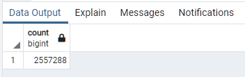

***Figure 1 - Count of review_id_table***


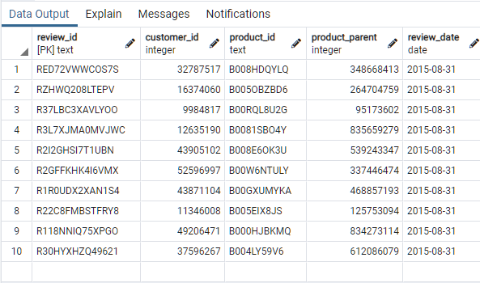

***Figure 2 - Top Rows of review_id_table***


```sql
SELECT COUNT(*) FROM products_table;
SELECT * FROM products_table FETCH FIRST 10 ROW ONLY;
```


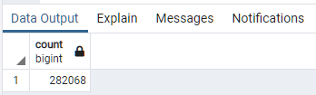

***Figure 3 - Count of products_table***


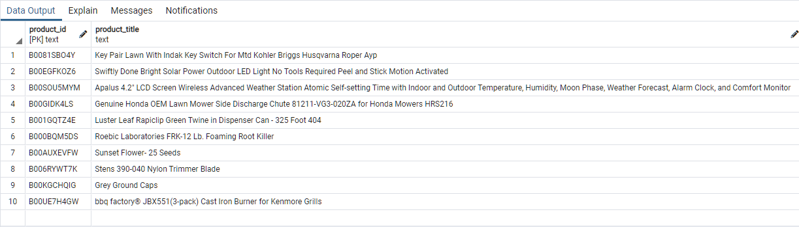

***Figure 4 - Top Rows of products_table***


```sql
SELECT COUNT(*) FROM customers_table;
SELECT * FROM customers_table FETCH FIRST 10 ROW ONLY;
```


***Figure 5 - Count of customers_table***


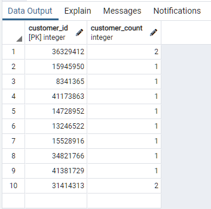

***Figure 6 - Top Rows of customers_table***


```sql
SELECT COUNT(*) FROM vine_table;
SELECT * FROM vine_table FETCH FIRST 10 ROW ONLY;
```


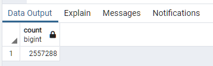

***Figure 7 - Count of vine_table***


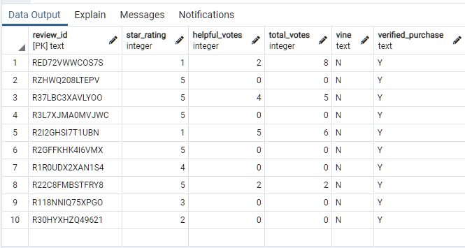

***Figure 8 - Top Rows of vine_table***


### 2.2 Determine Bias of Vine Reviews

In figures 9 through 13 and the associated code fences you can see how the review data is separated to conduct our analysis of paid and unpaid reviews.  Scroll don to figure 14 for a review of the 5 star analysis results and why we chose to have a more indepth looks at what was happening in the reviews.


```python
# Create the vine_table. DataFrame
vine_df = df.select(["review_id", "star_rating", "helpful_votes", "total_votes", "vine", "verified_purchase"])
vine_df.show()
```


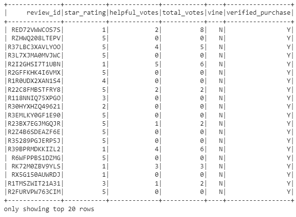

***Figure 9 - DataFrame of Vine Table Data***


```python
# The data is filtered to create a DataFrame where there are 20 or more total votes
vine_df_filtered = vine_df.filter(vine_df.total_votes >= "20")
vine_df_filtered.show()
```


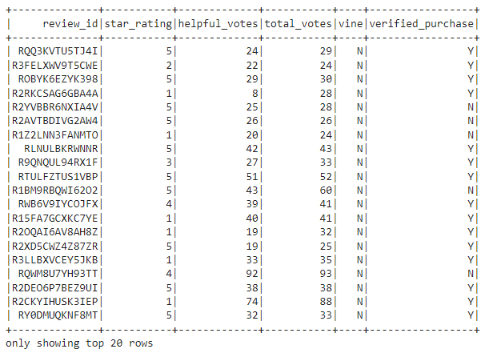

***Figure 10 - Filtered Dataframe with 20 or More Votes***


```python
# The data is filtered to create a DataFrame where the percentage of helpful_votes is equal to or greater than 50%
help_total_50_plus = vine_df_filtered.filter(vine_df_filtered.helpful_votes/vine_df_filtered.total_votes >= .5)
help_total_50_plus.show()
```


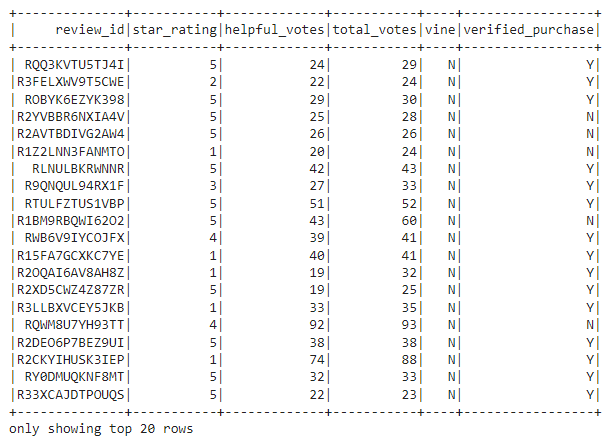

***Figure 11 - Helpful Votes Equal or Greater than 50 Percent***


```python
# The data is filtered to create a DataFrame or table where there is a Vine review
helpful_paid = help_total_50_plus.filter(help_total_50_plus.vine == 'Y')
helpful_paid.show()
```

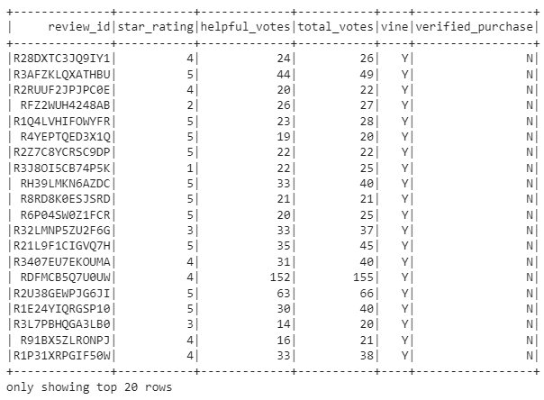

***Figure 12 - DataFrame with Vine Review***


```python
# The data is filtered to create a DataFrame where there isn’t a Vine review
helpful_unpaid = help_total_50_plus.filter(help_total_50_plus.vine == 'N')
helpful_unpaid.show()
```


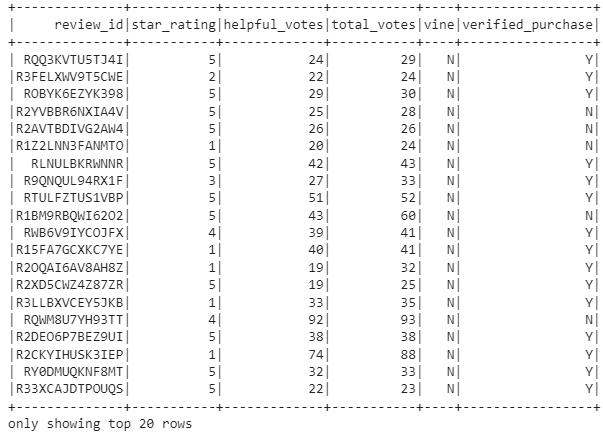

***Figure 13 - DataFrame without Vine Review***


As can be seen in figure 14 below a very small percentage of all 5 star review are paid.

```python
# The total number of reviews, the number of 5-star reviews, and the percentage 5-star reviews are calculated
# for all Vine and non-Vine reviews 

total_reviews = help_total_50_plus.count()
print("Total Reviews = ", total_reviews)

total_paid_5 = helpful_paid.filter(helpful_paid.star_rating == '5').count()
percent_paid_5 = total_paid_5/total_reviews*100
print("Total Paid 5 Star Reviews = ", total_paid_5, "(",percent_paid_5,"%)")

total_unpaid_5 = helpful_unpaid.filter(helpful_unpaid.star_rating == '5').count()
percent_unpaid_5 = total_unpaid_5/total_reviews*100
print("Total Unpaid 5 Star Reviews = ", total_unpaid_5, "(",percent_unpaid_5,"%)")

```


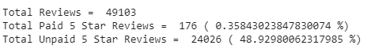

***Figure 14 - Final Results of the 5 Star Review Analysis***

In the code fence below we have calculated the percentage of paid and unpaid reviews that resulted in a 5 star outcome.

```python
# 5. Determine the total number of reviews, the number of 5-star reviews, and the
#    percentage of 5-star reviews for the two types of review (paid vs unpaid).

total_reviews = help_total_50_plus.count()
print("Total Reviews = ", total_reviews)
total_paid_reviews = helpful_paid.count()
print("Total Paid Reviews = ", total_paid_reviews)

total_paid_5 = helpful_paid.filter(helpful_paid.star_rating == '5').count()
percent_paid_5 = total_paid_5/total_paid_reviews*100
print("Total Paid 5 Star Reviews = ", total_paid_5, "(",percent_paid_5,"%)")

total_unpaid_reviews = helpful_unpaid.count()
print("Total Unpaid Reviews = ", total_unpaid_reviews)

total_unpaid_5 = helpful_unpaid.filter(helpful_unpaid.star_rating == '5').count()
percent_unpaid_5 = total_unpaid_5/total_unpaid_reviews*100
print("Total Unpaid 5 Star Reviews = ", total_unpaid_5, "(",percent_unpaid_5,"%)")
```

At 45.6% for paid and 49.3% for unpaid it would appear that the paid reviews are similar to unpaid and perhaps slightly less favorable.

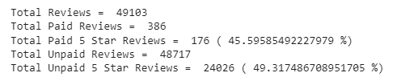

***Figure 15 - 5 Star Review Results by Group***

Being slightly less favorable was not an expected outcoming and so we conducted further analysis, see section 2.3 for details.

### 2.3 Validating the Bias Analysis

In an effort to validate the finds found in the five star reviews we conducted further and more extensive analysis.  In the code fence below we created a dataframe to look at the distribution of paid ratings.

```python
# Distribution of Paid Rating 
star_groups_paid = helpful_paid.groupBy(helpful_paid.star_rating).count()
star_groups_paid = star_groups_paid.sort(star_groups_paid.star_rating)
star_groups_paid.show()
```

In figure 16 below you can see that the paid ratings are heavily weight to the high end of the star scale.


***Figure 16 - Distribution of Paid Reviews***

This dataframe was then converted to a Pandas dataframe using the code fence below, so that it was easier to work with.

```python
import pandas as pd
paid_pandasDF = star_groups_paid.toPandas()
paid_pandasDF
```

In figure 17 is displayed the Pandas dataframe that we use to conduct further analysis.

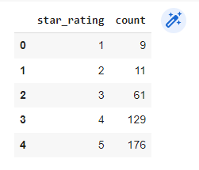

***Figure 17 - Pandas Distribution of Paid Reviews***

The following code fence was used to calculate the weighted average of paid reviews.

```python
import numpy as np
weighted_average_paid = np.average(a =paid_pandasDF['star_rating'] , weights = paid_pandasDF['count'])
weighted_average_paid
```

The resulting average for paid reviews was calculated to be 4.170984455958549.


We conducted the same analysis for upnpaid reviews.   Using the code fence below we created a dataframe to look at the distribution of unpaid ratings.

```python
# Distribution of Unpaid Rating 
star_groups_unpaid = helpful_unpaid.groupBy(helpful_unpaid.star_rating).count()
star_groups_unpaid = star_groups_unpaid.sort(star_groups_unpaid.star_rating)
star_groups_unpaid.show()
```

In figure 18 below you can see that the unpaid ratings are distributed quite differently than those of the paid.  The distribution is almost binary, with a large number of stars rating at both ends of the scale.


***Figure 18 - Distribution of Unpaid Reviews***

This dataframe was then also converted to a Pandas dataframe using the code fence below.

```python
import pandas as pd
unpaid_pandasDF = star_groups_unpaid.toPandas()
unpaid_pandasDF
```

In figure 19 is displayed the Pandas dataframe that we conducted further analysis on.

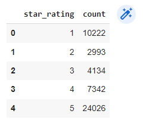

***Figure 19 - Pandas Distribution of Unpaid Reviews***

The following code fence was used to calculate the weighted average of unpaid reviews.

```python
import numpy as np
weighted_average_unpaid = np.average(a =unpaid_pandasDF['star_rating'] , weights = unpaid_pandasDF['count'])
weighted_average_unpaid
```

The resulting average for unpaid reviews was calculated to be 3.6559722478806167.

Conducting this analysis it is clear that the paid reviews are in fact bias.  Using the code fence below we calculated that bias.

```python
# Calculate the Paid Ratings Bias
paid_bias = (weighted_average_paid/weighted_average_unpaid - 1)*100
paid_bias
```

It was determined the the paid reviews were 14.086874110614133 % biased towards providing favorable reviews.

## Summary

The ETL process to clean data, load it to an Amazon RDS and make that data accessible from pgAdmin is very useful and the data is highly accessible without having the burden of storing millions of rows of data in local storage.  Using PySpark and Pandas to quickly conduct analysis on large dataframes is also of tremendous value.  Big data is definitely a major hurtle for growing businesses to overcome - I would advise that SellBy continue to invest in these big data tools.

As far as Vine reviews go it is very clear that at 14.1% the paid reviews are clearly biased to be favorable.  The fact that the 5 star reviews are less favorable for the paid reviews is an interesting observation.  I would explain this as follows:

- Manufactures who paid to have their product reviewed, likely believe that it will compare well in the market - this could explain why the paid reviews at 4.2 stars are screwed to the high end.
- Unpaid reviews are open to anyone and the large number of 1 star reviews could be explained by the large number of possibly inferior products in the market - this would also explain why the unpaid reviews at 3.7 stars are close to centre.
- The slightly lower number of 5 star reviews to me indicated that paid reviews are likely more reliable and that the reviewer has try to be fair to the reader.

All that said I think it is appropriate to the read to interpret these results based on their own understanding of the Vine program reviews.
